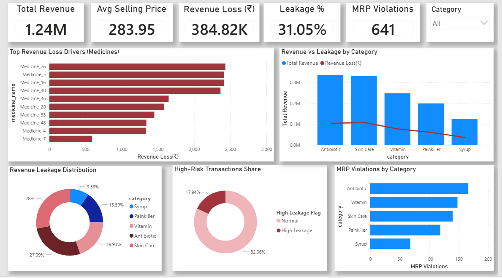
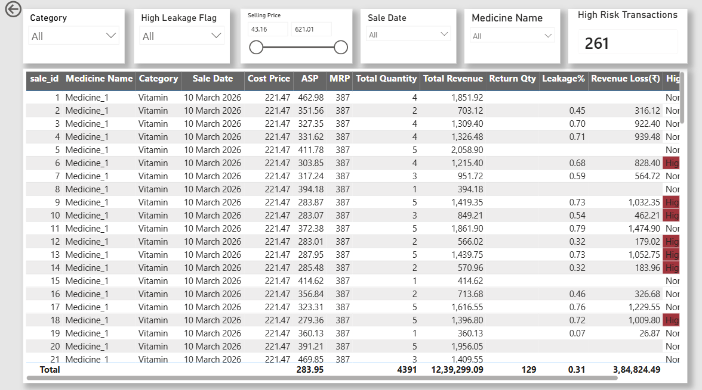

# 📊 Revenue Leakage Detection Dashboard – Medical Store

This project focuses on identifying revenue leakage in a simulated medical store dataset using Python, SQL, and Power BI.

---

## 🎯 Objective

To detect hidden revenue loss caused by pricing inconsistencies, MRP violations, and operational inefficiencies, and present insights through an interactive dashboard.

---

## 🧰 Tech Stack

- **Python** – Data generation  
- **SQLite / SQL** – Data querying and analysis  
- **Power BI** – Dashboard, DAX, and visualization  

---

## 📈 Key Insights

- ~31% revenue leakage identified due to underpricing  
- 600+ MRP violations detected indicating compliance issues  
- High-risk transactions flagged using rule-based logic  
- Specific product categories contributed most to revenue loss  

---

## 📊 Dashboard Preview

### 🟣 Executive Overview

### 🟢 Transaction Drilldown

---

## 🚀 Features

- KPI tracking (Total Revenue, Revenue Leakage, Leakage %, MRP Violations)  
- Category-level and product-level analysis  
- Transaction-level drilldown with filtering and slicers  
- Conditional formatting to highlight high-risk transactions  
- Interactive dashboard for business decision-making  

---

## 🧠 Project Highlights

- Built an end-to-end analytics pipeline (Python → SQL → Power BI)  
- Designed DAX measures for revenue leakage and risk detection  
- Created a structured data model with proper relationships  
- Focused on business problem-solving rather than just visualization  

---

## 📂 Project Structure

Revenue-Leakage-Detection/
├── powerbi/
│ └── Revenue_Leakage.pbix
├── python/
│ ├── data_generator.py
│ └── load_to_sqlite.py
├── sql/
│ └── analysis_queries.sql
├── images/
│ ├── overview.png
│ └── drilldown.png
└── README.md

---

## 💡 Learnings

- Data modeling and relationship handling in Power BI  
- Writing efficient SQL queries for business analysis  
- Using DAX for KPI calculations and conditional logic  
- Translating business problems into data-driven insights  

---

## 🎤 Interview Talking Points

- Identified significant revenue leakage using pricing comparison logic  
- Built KPI-driven dashboards for executive and operational use  
- Implemented transaction-level analysis to detect high-risk cases  
- Designed the solution keeping real-world business use in mind  

---

## 📎 Author

**Sanjana Gandhi**
